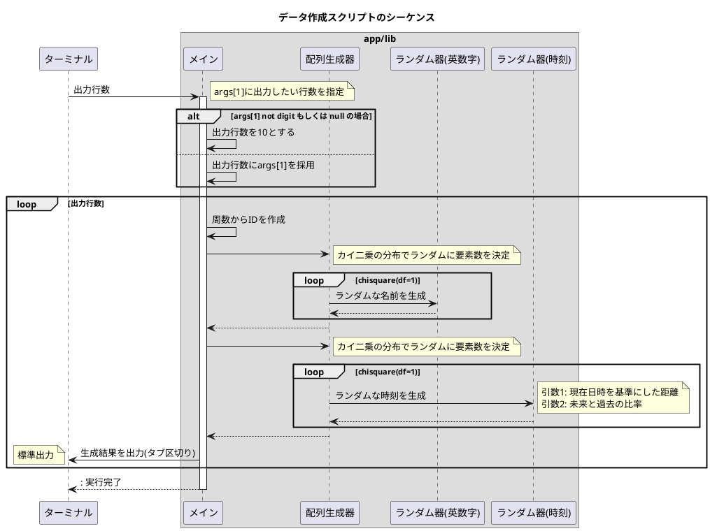

```puml
@startuml
title データ作成スクリプトのシーケンス
participant term as "ターミナル"
box app/lib
participant main as "メイン"
participant rArr as "配列生成器"
participant rName as "ランダム器(英数字)"
participant rDate as "ランダム器(時刻)"
end box

term -> main: 出力行数
note right
    args[1]に出力したい行数を指定
end note
activate main

alt args[1] not digit もしくは null の場合
    main -> main: 出力行数を10とする
else
    main -> main: 出力行数にargs[1]を採用
end

loop 出力行数
    main -> main: 周数からIDを作成
    main -> rArr
    note right
        カイ二乗の分布でランダムに要素数を決定
    end note

    loop chisquare(df=1)
        rArr -> rName: ランダムな名前を生成
        rArr <-- rName
    end

    main <-- rArr
    main -> rArr
    note right
        カイ二乗の分布でランダムに要素数を決定
    end note

    loop chisquare(df=1)
        rArr -> rDate: ランダムな時刻を生成
        note right
            引数1: 現在日時を基準にした距離
            引数2: 未来と過去の比率
        end note
        rArr <-- rDate
    end

    main <-- rArr
    main -> term: 生成結果を出力(タブ区切り)
    note left
        標準出力
    end note
end
return: 実行完了


@enduml
```
